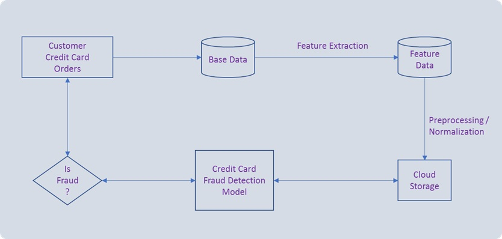

## Credit Card Fraud Detection

### Goal
Build models to detect credit card fraud transactions. At the end of this project, customers will have created:

1. A reasonable credit card fraud detection model and training jobs in datalab.
2. A reasonable credit card fraud detection model and training jobs in GCP production environment.
3. Small UI on App Engine to show off the model.
4. Bonus: continuous training and prediction.

### Challenges
1. Due to privacy concern, we couldn’t provide the original features or more background information on the features.
2. The dataset is highly unbalanced.

### Materials
1. Credit card fraud detection dataset.

    * The datasets contains transactions made by credit cards in September 2013 by european cardholders. This dataset presents transactions that occurred in two days, where we have 492 frauds out of 284,807 transactions. The dataset is highly unbalanced, the positive class (frauds) account for 0.172% of all transactions. It contains only numerical input variables which are the result of a PCA transformation. Unfortunately, due to confidentiality issues, we cannot provide the original features and more background information about the data. Features V1, V2, to V28 are the principal components obtained with PCA, the only features which have not been transformed with PCA are 'Time' and 'Amount'. Feature 'Time' contains the seconds elapsed between each transaction and the first transaction in the dataset. The feature 'Amount' is the transaction Amount, this feature can be used for example-dependant cost-sensitive learning. Feature 'Class' is the response variable and it takes value 1 in case of fraud and 0 otherwise.Given the class imbalance ratio, we recommend measuring the accuracy using the Area Under the Precision-Recall Curve (AUPRC). Confusion matrix accuracy is not meaningful for unbalanced classification.

2. Why You Should Use Cross-Entropy Error Instead Of Classification Error Or Mean Squared Error For Neural Network Classifier Training

3. App Engine Standard Environment Tutorial

    * App Engine example to predict car accident from images
    * An HTTP server running on GAE for making online predictions
    * If you need python libraries with C extensions such as Keras or Pandas in App Engine, you will need App Engine flexible environment. Keep in mind that the complexity will go up a lot.

4. Python libraries
    * Pandas library
        * read_csv
        * concat
        * DataFrame
    * matplotlib.pyplot
    * Seaborn.distplot
    * Bonus: sklearn.manifold.TSNE

### Roles and Responsibilities

Three teams with 1-2 people on each team. There are dependencies among teams. CloudML team depends on Datalab team, while App Engine Team depends on CloudML team. The depending teams can come up with simple mock model to unblock themselves.

* Datalab Team: explore data, experiment feature engineering, build and evaluate model.
* CloudML Team: move the training jobs and models from datalab to GCP production environment.
* App Engine Team: Upload the test dataset and call predict API. Build continuous training and prediction.

### Solution Overview

